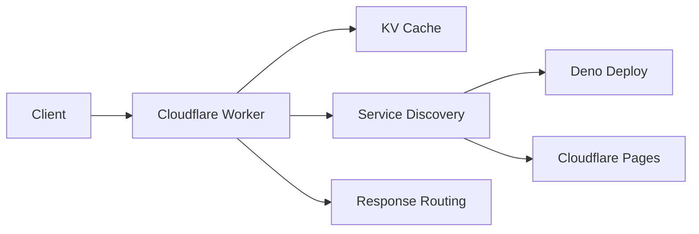

# UBQ.FI Router Documentation

Welcome to the complete documentation for the UBQ.FI Router - a high-performance TypeScript Cloudflare Worker that intelligently routes requests between Deno Deploy and Cloudflare Pages.

## 📚 Documentation Structure

### Core Documentation
- **[Architecture](additional/architecture.md)** - System design, data flow, and technical decisions
- **[API Reference](additional/api-reference.md)** - Complete API documentation and usage examples
- **[Deployment Guide](additional/deployment.md)** - Step-by-step deployment instructions
- **[Troubleshooting](additional/troubleshooting.md)** - Common issues and solutions

### Quick Links
- **[Getting Started](#getting-started)** - Quick setup guide
- **[Common Tasks](#common-tasks)** - Frequently needed operations
- **[Best Practices](#best-practices)** - Recommended patterns and approaches

## 🚀 Getting Started

### Prerequisites
```bash
# Install required tools
curl -fsSL https://bun.sh/install | bash
npm install -g wrangler
```

### Quick Setup
```bash
# 1. Install dependencies
bun install

# 2. Configure KV namespace in wrangler.toml
# 3. Deploy
bun run deploy

# 4. Test
curl -H "X-Cache-Control: refresh" https://pay.ubq.fi
```

### First Deployment
1. **[Setup Prerequisites](deployment.md#prerequisites)** - Install tools and create accounts
2. **[Initial Configuration](deployment.md#initial-setup)** - Configure KV namespaces and authentication
3. **[Deploy to Production](deployment.md#production-deployment)** - Deploy and verify

## 🔧 Common Tasks

### Cache Management
```bash
# Clear all cache entries
curl -H "X-Cache-Control: clear-all" https://ubq.fi

# Refresh specific service
curl -H "X-Cache-Control: refresh" https://newservice.ubq.fi

# Clear specific entry
curl -H "X-Cache-Control: clear" https://oldservice.ubq.fi
```

### Adding New Services
1. Deploy service to Deno Deploy or Cloudflare Pages
2. Clear cache: `curl -H "X-Cache-Control: refresh" https://newservice.ubq.fi`
3. Verify routing: `curl https://newservice.ubq.fi`

### Development Workflow
```bash
# Local development
bun run dev

# Type checking
bun run type-check

# Build and deploy
bun run deploy
```

## 📋 Best Practices

### Service Development
- **Use consistent naming**: Follow `subdomain-ubq-fi.platform.dev` pattern
- **Test thoroughly**: Verify both Deno Deploy and Cloudflare Pages deployments
- **Monitor performance**: Check response times and error rates

### Cache Management
- **Clear cache after deployments**: Use `X-Cache-Control: refresh` for new services
- **Bulk operations**: Use `clear-all` for major updates
- **Monitor TTL**: 1 hour for working services, 5 minutes for failures

### Debugging
- **Start with cache**: Clear cache first when troubleshooting
- **Test manually**: Check service URLs directly
- **Check logs**: Use Cloudflare Workers dashboard for detailed logs

## 🏗️ System Architecture



The router uses:
- **Intelligent Caching**: KV-based service discovery caching
- **Parallel Discovery**: Simultaneous checks of both platforms
- **Request Coalescing**: Prevents duplicate service discoveries
- **Streaming Responses**: No buffering for optimal performance

## 🎯 Key Features

### Performance
- **~23kb bundle size** - Optimized for fast execution
- **Parallel service discovery** - Checks both platforms simultaneously
- **Request coalescing** - Prevents duplicate work
- **Streaming responses** - No memory overhead

### Reliability
- **Intelligent fallback** - Deno Deploy → Cloudflare Pages → 404
- **Accurate service detection** - Only 2xx status codes count as "available"
- **Negative caching** - Prevents repeated failed discoveries
- **Timeout handling** - 3-second limit prevents hanging

### Developer Experience
- **TypeScript throughout** - Full type safety and IDE support
- **Modular architecture** - Clean separation of concerns
- **Comprehensive debugging** - Cache control and monitoring tools
- **Professional workflow** - Automated build and deployment
- **Plugin support** - Intelligent routing for os-* plugin domains with dev alias

### Plugin Routing
- **Production aliases** - `os-plugin.ubq.fi` → `plugin-main.deno.dev`
- **Explicit branches** - `os-plugin-main.ubq.fi` → `plugin-main.deno.dev`
- **Development routing** - `os-plugin-development.ubq.fi` → `plugin-development.deno.dev`
- **Dev alias** - `os-plugin-dev.ubq.fi` → `plugin-development.deno.dev` (NEW!)

## 📊 Performance Metrics

| Metric | Value | Description |
|--------|-------|-------------|
| Bundle Size | ~9.6kb | Optimized TypeScript compilation |
| Cache Hit | ~1ms | KV lookup only |
| Cache Miss | 100-500ms | Parallel service discovery |
| Service Discovery | 50-3000ms | Network dependent |
| Request Routing | 10-100ms | Proxy to target service |
| **Production Status** | **✅ DEPLOYED** | **Live on *.ubq.fi with 100% validation** |

## 🎯 **Production Validation Results**

### **✅ Comprehensive Testing Complete (100% Success)**
- **Service Discovery Accuracy: 10/10 (100%)**
- **UBQ.FI Domains Working: 10/10 (100%)**
- **Services with Deployments: 10/10 (100%)**

### **🌐 Live Production Services:**
```
✅ ubq.fi → service-pages (WORKING!)
✅ pay.ubq.fi → service-both
✅ work.ubq.fi → service-pages
✅ audit.ubq.fi → service-pages
✅ onboard.ubq.fi → service-pages
✅ keygen.ubq.fi → service-pages
✅ leaderboard.ubq.fi → service-pages
✅ safe.ubq.fi → service-pages
✅ uusd.ubq.fi → service-pages
✅ notifications.ubq.fi → service-pages
```

### **🚀 Deployment Details:**
- **Worker**: `ubq-fi-router` deployed with zone-based routing
- **Routes**: `ubq.fi/*` and `*.ubq.fi/*`
- **Zone ID**: 3aa0d877a0b4e3e1dcdc21eb643b13fc
- **Version**: bdc1d06a-c62f-44e5-bbc7-000fa188cd1c
- **Status**: All routes active and handling traffic

## 🔍 Troubleshooting Quick Reference

| Issue | Quick Fix |
|-------|-----------|
| Service shows as available but 404 | `curl -H "X-Cache-Control: clear" https://domain.ubq.fi` |
| Cache not updating | `curl -H "X-Cache-Control: clear-all" https://ubq.fi` |
| Build failures | `bun run type-check` then `bun install` |
| Deployment errors | Check KV namespace IDs in `wrangler.toml` |
| Slow responses | Check cache hit rates and service health |

## 📖 Documentation Navigation

### By Role

**Developers:**
- Start with [Architecture](additional/architecture.md) for system understanding
- Use [API Reference](additional/api-reference.md) for implementation details
- Check [Troubleshooting](additional/troubleshooting.md) for debugging

**DevOps/SRE:**
- Begin with [Deployment Guide](additional/deployment.md) for setup
- Monitor using [API Reference](additional/api-reference.md#monitoring)
- Handle issues with [Troubleshooting](additional/troubleshooting.md)

**Product/PM:**
- Review [Architecture](architecture.md#system-overview) for capabilities
- Understand features in [API Reference](api-reference.md#overview)
- Check performance in [Architecture](architecture.md#performance-optimizations)

### By Task

**Setting Up:**
1. [Deployment Guide](deployment.md#initial-setup)
2. [Architecture](architecture.md#configuration)
3. [API Reference](api-reference.md#development-api)

**Debugging:**
1. [Troubleshooting](troubleshooting.md#common-issues)
2. [API Reference](api-reference.md#error-responses)
3. [Architecture](architecture.md#error-handling)

**Optimizing:**
1. [Architecture](architecture.md#performance-optimizations)
2. [API Reference](api-reference.md#performance-metrics)
3. [Deployment Guide](deployment.md#monitoring-setup)

## 🤝 Contributing

### Documentation Updates
- Keep examples current with actual implementation
- Test all code snippets before committing
- Update version numbers and metrics as needed

### Code Changes
1. Update relevant documentation sections
2. Add troubleshooting entries for new features
3. Update API reference for interface changes

## 📞 Support

### Self-Service
1. **Search this documentation** - Most issues are covered
2. **Check [Troubleshooting](additional/troubleshooting.md)** - Common solutions
3. **Test manually** - Verify service URLs directly

### Escalation
1. **Gather information** - Error messages, configuration, steps attempted
2. **Check Cloudflare status** - Platform-wide issues
3. **Review worker logs** - Detailed error information

---

**Need immediate help?** Start with the [Troubleshooting Guide](additional/troubleshooting.md) for quick solutions to common issues.
