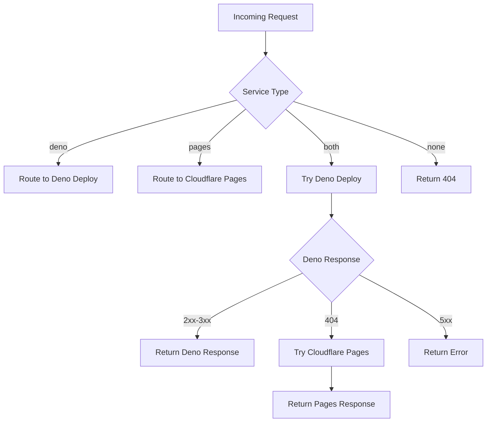

# API Reference

## Overview

The UBQ.FI Router provides a cache control API through HTTP headers and supports various routing configurations. This document provides complete API documentation for developers and system administrators.

## HTTP Headers API

### X-Cache-Control Header

The router supports cache control operations through the `X-Cache-Control` HTTP header.

#### Syntax
```
X-Cache-Control: <operation>
```

#### Operations

##### `refresh`
Forces service discovery and cache update for the requested domain.

**Usage:**
```bash
curl -H "X-Cache-Control: refresh" https://pay.ubq.fi
```

**Behavior:**
1. Bypasses existing cache entry
2. Performs fresh service discovery (Deno Deploy + Cloudflare Pages)
3. Updates cache with new results
4. Routes request based on discovered services
5. Returns proxied response from target service

**Response:** Normal service response or 404 if no services available

**TTL:** 1 hour for found services, 5 minutes for not found

##### `clear`
Removes the cache entry for the specific requested domain.

**Usage:**
```bash
curl -H "X-Cache-Control: clear" https://blog.ubq.fi
```

**Behavior:**
1. Deletes cache entry for the specific subdomain
2. Returns confirmation message

**Response:**
```
Cache cleared
```

**Status Code:** `200 OK`

##### `clear-all`
Removes all cache entries from the KV store.

**Usage:**
```bash
curl -H "X-Cache-Control: clear-all" https://ubq.fi
```

**Behavior:**
1. Lists all cache entries with prefix `route:`
2. Deletes all entries in parallel
3. Returns count of cleared entries

**Response:**
```
Cleared N cache entries
```

**Status Code:** `200 OK`

## Service Discovery API

### Internal Service Detection

The router internally performs HEAD requests to determine service availability.

#### Deno Deploy Detection
- **URL Pattern**: `https://{subdomain}-ubq-fi.deno.dev`
- **Method**: `HEAD`
- **Timeout**: 3 seconds
- **Success Criteria**: Status code 200-299

#### Cloudflare Pages Detection
- **URL Pattern**: `https://{subdomain}-ubq-fi.pages.dev`
- **Method**: `HEAD`
- **Timeout**: 3 seconds
- **Success Criteria**: Status code 200-299

### URL Mapping Rules

#### Root Domain
- **Input**: `ubq.fi`
- **Subdomain Key**: `""` (empty string)
- **Deno URL**: `https://ubq-fi.deno.dev`
- **Pages URL**: `https://ubq-fi.pages.dev`

#### Single Subdomain
- **Input**: `pay.ubq.fi`
- **Subdomain Key**: `"pay"`
- **Deno URL**: `https://pay-ubq-fi.deno.dev`
- **Pages URL**: `https://pay-ubq-fi.pages.dev`


#### Plugin Domains
- **Input**: `os-command-config.ubq.fi`
- **Plugin Name**: `"command-config-main"` (production alias)
- **Target URL**: `https://command-config-main.deno.dev`

- **Input**: `os-command-config-main.ubq.fi`
- **Plugin Name**: `"command-config-main"`
- **Target URL**: `https://command-config-main.deno.dev`

- **Input**: `os-command-config-development.ubq.fi`
- **Plugin Name**: `"command-config-development"`
- **Target URL**: `https://command-config-development.deno.dev`

- **Input**: `os-command-config-dev.ubq.fi`
- **Plugin Name**: `"command-config-development"` (dev alias)
- **Target URL**: `https://command-config-development.deno.dev`

## Cache API

### Cache Key Structure

**Pattern:** `route:{subdomain}`

#### Examples
| Domain | Cache Key |
|--------|-----------|
| `ubq.fi` | `route:` |
| `pay.ubq.fi` | `route:pay` |
| `demo.ubq.fi` | `route:demo` |

### Cache Value Types

| Value | Description | Routing Behavior |
|-------|-------------|------------------|
| `"deno"` | Only Deno Deploy service exists | Direct route to Deno Deploy |
| `"pages"` | Only Cloudflare Pages service exists | Direct route to Cloudflare Pages |
| `"both"` | Both services exist | Try Deno Deploy first, fallback to Pages on 404 |
| `"none"` | No services exist | Return 404 Service not found |

### TTL Configuration

| Scenario | TTL | Reason |
|----------|-----|--------|
| Service found (2xx) | 3600 seconds (1 hour) | Reduce repeated checks for stable services |
| Service not found | 300 seconds (5 minutes) | Allow quick recovery when services come online |

## Routing API

### Request Routing Logic



### Request Preservation

When proxying requests, the router preserves:
- **HTTP Method** (GET, POST, PUT, DELETE, etc.)
- **Request Headers** (Authorization, Content-Type, etc.)
- **Request Body** (for POST/PUT requests)
- **Query Parameters**
- **Path Parameters**

### Response Streaming

The router streams responses without buffering:
- **Headers**: Preserved from target service
- **Status Code**: Preserved from target service
- **Body**: Streamed directly to client
- **Performance**: No memory overhead for large responses

## Error Responses

### 404 Service Not Found
**Trigger**: No services available for the requested domain
**Response:**
```
Service not found
```
**Status Code:** `404 Not Found`

### Timeout Errors
**Trigger**: Service discovery timeout (>3 seconds)
**Behavior**: Service treated as unavailable
**Impact**: May result in fallback routing or 404

### Network Errors
**Trigger**: DNS failures, connection errors
**Behavior**: Service treated as unavailable
**Impact**: Automatic fallback to alternative service

## Rate Limiting

### Service Discovery Rate Limiting
- **Request Coalescing**: Multiple requests for same domain share one discovery
- **Timeout**: 3-second maximum per service check
- **Parallel Limit**: 2 simultaneous checks (Deno + Pages)

### Cache Rate Limiting
- **KV Operations**: No built-in limits (handled by Cloudflare)
- **Bulk Operations**: `clear-all` processes all entries in parallel

## Status Codes

### Success Responses
- `200 OK`: Normal proxied response
- `200 OK`: Cache control operations

### Client Error Responses
- `404 Not Found`: No services available

### Server Error Responses
- `5xx`: Proxied errors from target services

## Development API

### Local Development

**Wrangler Dev Server:**
```bash
bun run dev
```

**Test with Host Header:**
```bash
curl http://localhost:8787 -H "Host: pay.ubq.fi"
```

### Type Definitions

#### ServiceType
```typescript
type ServiceType = "deno" | "pages" | "both" | "none"
```

#### CacheControlValue
```typescript
type CacheControlValue = "refresh" | "clear" | "clear-all" | null
```

#### Environment Interface
```typescript
interface Env {
  ROUTER_CACHE: KVNamespace
}
```

## Integration Examples

### Deployment Testing
```bash
# Deploy new service
# ... deploy to Deno Deploy or Cloudflare Pages ...

# Clear cache for immediate routing
curl -H "X-Cache-Control: refresh" https://newservice.ubq.fi

# Verify routing
curl https://newservice.ubq.fi
```

### Cache Management
```bash
# Clear all cache (fresh start)
curl -H "X-Cache-Control: clear-all" https://ubq.fi

# Refresh specific service
curl -H "X-Cache-Control: refresh" https://pay.ubq.fi

# Clear specific cache entry
curl -H "X-Cache-Control: clear" https://old-service.ubq.fi
```

### Monitoring
```bash
# Check service availability
curl -I https://pay.ubq.fi

# Force fresh discovery
curl -H "X-Cache-Control: refresh" https://pay.ubq.fi

# Monitor cache state in Cloudflare KV dashboard
```

## Security Considerations

### Header Validation
- Cache control headers are validated against allowed values
- Invalid headers are ignored (treated as normal requests)

### Request Safety
- Only GET/HEAD requests are used for service discovery
- Original request method is preserved for routing
- No sensitive data is logged or cached

### Resource Protection
- 3-second timeout prevents resource exhaustion
- Request coalescing prevents duplicate load
- Cache TTL prevents unbounded growth

## Performance Metrics

### Timing Benchmarks
- **Cache Hit**: ~1ms (KV lookup only)
- **Cache Miss**: ~100-500ms (parallel service discovery)
- **Service Discovery**: ~50-3000ms (network dependent)
- **Request Routing**: ~10-100ms (network dependent)

### Resource Usage
- **Bundle Size**: ~4.6kb
- **Memory**: Minimal (streaming responses)
- **KV Operations**: 1-2 per request (read + conditional write)

This API reference provides complete documentation for integrating with and operating the UBQ.FI Router system.
