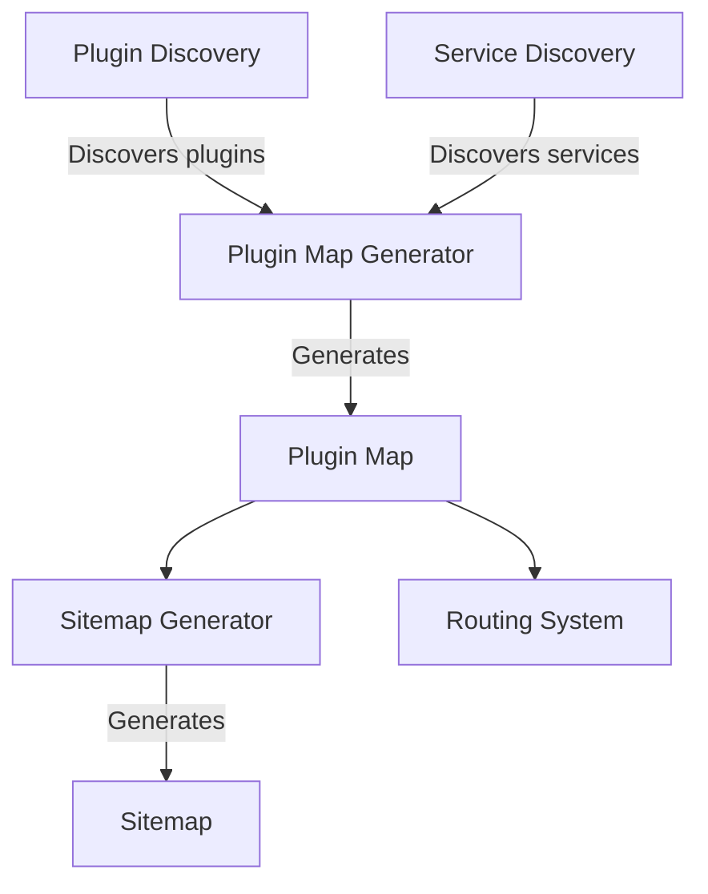

# Architecture: Plugin-Map and Sitemap Systems

## Core Architecture


## Plugin Map System
- **Discovery**: `src/plugin-map-discovery.ts`
  - Discovers plugins from configured endpoints
  - Uses `get-known-plugins.ts` for known plugin registry
- **Generation**: `src/plugin-map-generator.ts`
  - Creates unified plugin map
  - Stores in Cloudflare KV for fast access
- **Key Components**:
  ```typescript
  // src/types.ts
  interface PluginMap {
    [pluginName: string]: {
      baseDomain: string;
      routes: RouteDefinition[];
      services: ServiceDefinition[];
    }
  }
  ```

## Sitemap System
- **Discovery**: `src/sitemap-discovery.ts`
  - Collects URLs from all discovered plugins
- **Generation**: `src/sitemap-generator.ts`
  - Creates XML sitemap compliant with SEO standards
  - Automatically updates when plugins change
- **Key Features**:
  - Dynamic URL generation based on plugin routes
  - Priority-based sorting of URLs
  - Automatic handling of plugin updates

## Integration Points
- Plugin map serves as source for both routing and sitemaps
- Health dashboard monitors both systems
- DNS scripts (`scripts/update-dns-records.ts`) ensure correct domain mapping
