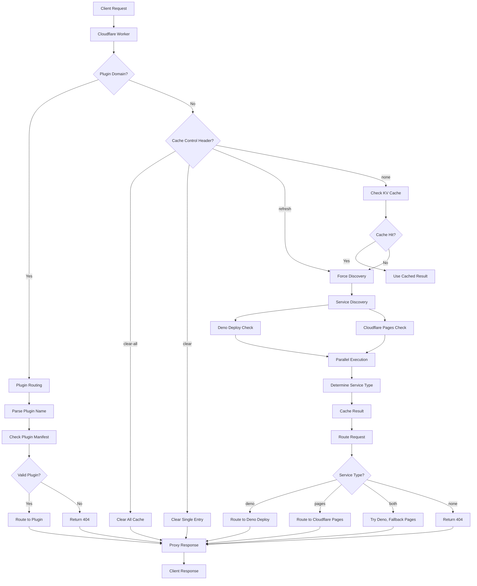
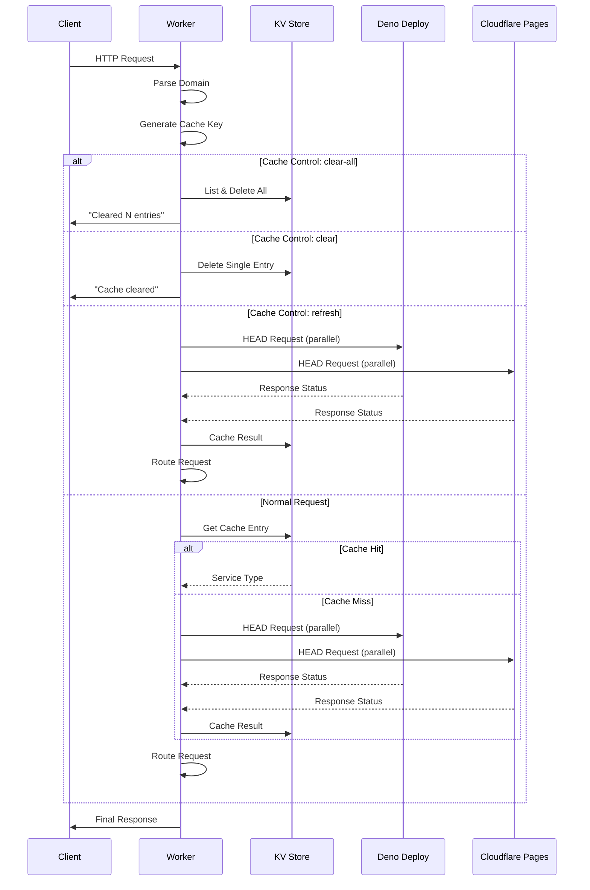

# Architecture Documentation

## System Overview

The UBQ.FI Router is a sophisticated Cloudflare Worker that provides intelligent routing, caching, and service discovery for the ubq.fi domain ecosystem. This document details the system architecture, data flow, and design decisions.

## High-Level Architecture



## Component Architecture

### 1. Main Worker (`worker.ts`)
- **Purpose**: Request orchestration and cache management
- **Responsibilities**:
  - Parse incoming requests
  - Handle cache control headers
  - Coordinate service discovery
  - Route requests to appropriate services

### 2. Service Discovery (`service-discovery.ts`)
- **Purpose**: Determine which services are available
- **Key Features**:
  - Parallel service checking
  - Request coalescing to prevent duplicate discoveries
  - Timeout management (3 second limit)
  - Accurate service detection (2xx status codes only)

### 3. URL Utilities (`utils.ts`)
- **Purpose**: Transform domains to service URLs
- **Standard Mapping Logic**:
  ```typescript
  // Deno Deploy
  ubq.fi → ubq-fi.deno.dev
  pay.ubq.fi → pay-ubq-fi.deno.dev
  // Cloudflare Pages
  ubq.fi → ubq-fi.pages.dev
  pay.ubq.fi → pay-ubq-fi.pages.dev
  ```
- **Plugin Mapping Logic**:
  ```typescript
  // Plugin Routing (os-*.ubq.fi)
  os-command-config.ubq.fi → command-config-main.deno.dev (production alias)
  os-command-config-main.ubq.fi → command-config-main.deno.dev
  os-command-config-dev.ubq.fi → command-config-dev.deno.dev
  os-pricing-calculator-feature-ui.ubq.fi → pricing-calculator-feature-ui.deno.dev
  ```

### 4. Request Routing (`routing.ts`)
- **Purpose**: Proxy requests to target services
- **Features**:
  - Streaming responses (no buffering)
  - Intelligent fallback logic
  - Request preservation (headers, body, method)

### 5. Type Definitions (`types.ts`)
- **Purpose**: TypeScript type safety
- **Key Types**:
  - `ServiceType`: Service availability states
  - `CacheControlValue`: Cache control options
  - `RouteConfig`: Routing configuration

## Data Flow

### 1. Request Processing


### 2. Service Discovery Process
```mermaid
graph TD
    A[Start Discovery] --> B[Generate URLs]
    B --> C[Deno URL]
    B --> D[Pages URL]

    C --> E[HEAD Request]
    D --> F[HEAD Request]

    E --> G[Check Status Code]
    F --> H[Check Status Code]

    G --> I{2xx Status?}
    H --> J{2xx Status?}

    I -->|Yes| K[Deno Exists = true]
    I -->|No| L[Deno Exists = false]
    J -->|Yes| M[Pages Exists = true]
    J -->|No| N[Pages Exists = false]

    K --> O[Combine Results]
    L --> O
    M --> O
    N --> O

    O --> P{Both Exist?}
    P -->|Yes| Q[Return "both"]
    P -->|No| R{Deno Only?}
    R -->|Yes| S[Return "deno"]
    R -->|No| T{Pages Only?}
    T -->|Yes| U[Return "pages"]
    T -->|No| V[Return "none"]
```

## Plugin Routing Architecture

### Plugin Domain Detection
```typescript
// Pattern matching for plugin domains
export function isPluginDomain(hostname: string): boolean {
  return hostname.startsWith('os-') && hostname.endsWith('.ubq.fi')
}
```

### Plugin Name Resolution
The router implements intelligent deployment suffix handling:

```typescript
// Production alias system
os-command-config.ubq.fi → command-config-main.deno.dev
os-command-config-main.ubq.fi → command-config-main.deno.dev

// Development deployments
os-command-config-dev.ubq.fi → command-config-dev.deno.dev

// Feature branches
os-command-config-feature-auth.ubq.fi → command-config-feature-auth.deno.dev
```

### Plugin Discovery Flow
```mermaid
graph TD
    A[Plugin Request] --> B[Extract Plugin Name]
    B --> C[Apply Production Alias]
    C --> D[Build Target URL]
    D --> E[Check Cache]
    E --> F{Cache Hit?}
    F -->|Yes| G[Use Cached Result]
    F -->|No| H[Validate Manifest]
    H --> I[GET /manifest.json]
    I --> J{Valid JSON?}
    J -->|Yes| K[Cache as "plugin"]
    J -->|No| L[Cache as "none"]
    K --> M[Route to Plugin]
    L --> N[Return 404]
    G --> O{Cached Type?}
    O -->|"plugin"| M
    O -->|"none"| N
```

### Manifest Validation
```typescript
interface PluginManifest {
  name: string
  description: string
  [key: string]: any  // Additional plugin-specific fields
}
```

Plugin discovery validates:
1. HTTP 200 response from `/manifest.json`
2. Valid JSON parsing
3. Required `name` and `description` fields
4. Response within 3-second timeout

## Caching Strategy

### Cache Key Structure
- **Standard Pattern**: `route:{subdomain}`
- **Plugin Pattern**: `plugin:{plugin-name}`
- **Examples**:
  - `route:` (for ubq.fi)
  - `route:pay` (for pay.ubq.fi)
  - `plugin:command-config-main` (for plugin cache)

### Cache Value Types
| Value | Meaning | Routing Behavior |
|-------|---------|------------------|
| `"deno"` | Only Deno Deploy exists | Route to Deno Deploy |
| `"pages"` | Only Cloudflare Pages exists | Route to Cloudflare Pages |
| `"both"` | Both services exist | Try Deno, fallback to Pages |
| `"plugin"` | Plugin exists with valid manifest | Route directly to plugin |
| `"none"` | No services exist | Return 404 |

### TTL Strategy
- **Success Cases**: 1 hour (3600 seconds)
  - Services that return 2xx status codes
  - Reduces repeated successful checks
- **Failure Cases**: 5 minutes (300 seconds)
  - Services that don't exist or return errors
  - Allows faster recovery when services come online

### Request Coalescing
```typescript
const inFlightDiscoveries = new Map<string, Promise<ServiceType>>()
```
- Prevents duplicate discovery requests for the same subdomain
- Multiple concurrent requests for the same domain share one discovery
- Improves performance and reduces load on target services

## Performance Optimizations

### 1. Parallel Service Discovery
```typescript
const [denoExists, pagesExists] = await Promise.all([
  serviceExists(denoUrl),
  serviceExists(pagesUrl)
])
```
- Checks both services simultaneously
- Reduces discovery time from sequential to parallel

### 2. Streaming Responses
```typescript
return new Response(response.body, {
  status: response.status,
  statusText: response.statusText,
  headers: response.headers
})
```
- No response buffering
- Immediate streaming to client
- Optimal for large responses

### 3. Timeout Management
```typescript
signal: AbortSignal.timeout(3000)
```
- 3-second timeout for service checks
- Prevents hanging requests
- Fast failure for unavailable services

### 4. Efficient Cache Operations
- Bulk cache clearing with `list()` and `Promise.all()`
- Minimal KV operations
- Strategic cache key design

## Error Handling

### Service Detection Accuracy
```typescript
// Only 2xx status codes indicate working services
return response.status >= 200 && response.status < 300
```
- Excludes Cloudflare error pages (5xx)
- Excludes DNS errors and other failures
- Ensures cache accuracy

### Fallback Mechanisms
1. **Service Level**: Deno Deploy → Cloudflare Pages → 404
2. **Cache Level**: Cache miss → Service discovery → Cache update
3. **Network Level**: Timeout → Assume service unavailable

### Graceful Degradation
- Network failures don't crash the worker
- Timeouts are handled gracefully
- Cache corruption is prevented

## Security Considerations

### Request Validation
- Domain parsing with error handling
- Cache control header validation
- Type-safe request processing

### Resource Protection
- Request coalescing prevents abuse
- Timeout limits prevent resource exhaustion
- Cache TTL prevents infinite storage growth

### Data Integrity
- TypeScript ensures type safety
- Structured error handling
- Validated cache operations

## Monitoring and Observability

### Built-in Metrics
- Bundle size: ~9.6kb (optimized)
- Request timeout: 3 seconds
- Cache TTL: 1 hour (success), 5 minutes (failure)

### Production Validation Results
- **Service Discovery Accuracy**: 10/10 (100%)
- **UBQ.FI Domains Working**: 10/10 (100%)
- **Services with Deployments**: 10/10 (100%)
- **Deployment Status**: ✅ Live in production
- **Zone Configuration**: Active with `ubq.fi/*` and `*.ubq.fi/*` routes
- **Version**: bdc1d06a-c62f-44e5-bbc7-000fa188cd1c

### Debug Capabilities
- Cache control headers for testing
- Clear cache functionality
- Service discovery tracing via status codes

### KV Monitoring
- Cache hit/miss patterns
- Service availability trends
- Cache entry lifecycle tracking

## Scalability

### Horizontal Scaling
- Cloudflare's global edge network
- Automatic scaling with traffic
- No server management required

### Performance Scaling
- KV cache reduces service discovery load
- Request coalescing prevents thundering herd
- Parallel processing minimizes latency

### Storage Scaling
- KV automatically scales with usage
- Efficient cache key structure
- Automatic TTL-based cleanup

## Design Decisions

### Why TypeScript?
- Type safety prevents runtime errors
- Better IDE support and refactoring
- Self-documenting code with interfaces

### Why Modular Architecture?
- Separation of concerns
- Easier testing and maintenance
- Reusable components

### Why Request Coalescing?
- Prevents duplicate service discoveries
- Reduces load on target services
- Improves response times

### Why 2xx-Only Service Detection?
- Accurate service availability detection
- Excludes error pages and DNS failures
- Prevents false positives in cache

This architecture provides a robust, scalable, and maintainable solution for intelligent request routing with comprehensive caching and service discovery capabilities.
