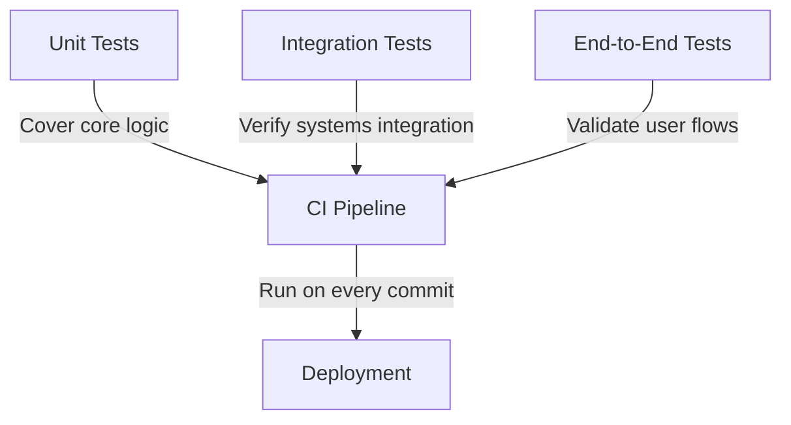

# Health Dashboard

## Overview
The health dashboard provides real-time monitoring of plugin and service statuses through `src/health-dashboard/api.ts`. It integrates with the plugin map and service discovery systems to provide comprehensive system health visibility.

## Key Features
- Real-time status monitoring
- Historical health trends
- Alerting for critical issues
- Integration with plugin map and service discovery

## Test Coverage Requirements
### Critical Features Requiring >90% Test Coverage
1. **API Endpoints** (`src/health-dashboard/api.ts`)
   - GET /health/status
   - GET /health/history
   - POST /health/alert

2. **Health Calculation Logic**
   - Plugin health scoring
   - Service health aggregation
   - Status transition detection

3. **Alerting System**
   - Threshold-based alerts
   - Notification routing
   - Alert suppression

### Testing Strategy


### Test Implementation
Example test for health status endpoint:
```typescript
// tests/health-api.test.ts
import { app } from '../src/health-dashboard/api';
import { test } from 'bun:test';

test('GET /health/status returns 200', async () => {
  const res = await app.request('/health/status');
  expect(res.status).toBe(200);
  expect(await res.json()).toHaveProperty('status', 'ok');
});
```

### Coverage Enforcement
- Coverage thresholds in `package.json`:
```json
"scripts": {
  "test:coverage": "bun test --coverage",
  "check:coverage": "bun coverage-check.js"
}
```

- Coverage check script (`coverage-check.js`):
```javascript
const coverage = require('./coverage/coverage-summary.json');
const criticalFiles = [
  'src/health-dashboard/api.ts',
  'src/core/health-calculator.ts'
];

for (const file of criticalFiles) {
  if (coverage[file]?.lines.pct < 90) {
    throw new Error(`Coverage for ${file} is below 90%`);
  }
}
