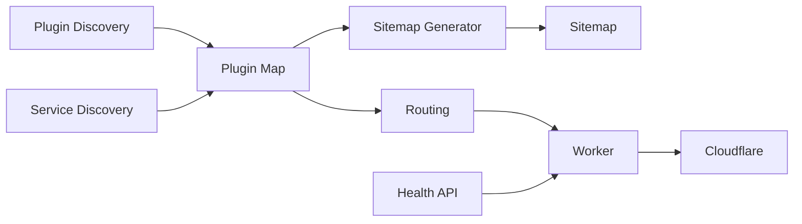

# System Patterns

## Architecture Overview
- Plugin-based architecture with dynamic discovery
- Sitemap generation for SEO optimization
- Cloudflare Workers-based deployment

## Key Technical Decisions
1. **Plugin Map System**
   - Discovered via `src/plugin-map-discovery.ts`
   - Generated by `src/plugin-map-generator.ts`
   - Stored in Cloudflare KV for fast access

2. **Sitemap System**
   - Discovered via `src/sitemap-discovery.ts`
   - Generated by `src/sitemap-generator.ts`
   - Automatically updated when plugins change

3. **Routing**
   - Unified routing handled by `src/routing.ts`
   - Supports both plugin routes and service routes

## Component Relationships

## Design Patterns
- Factory pattern for discovery mechanisms
- Strategy pattern for different routing scenarios
- Observer pattern for plugin changes